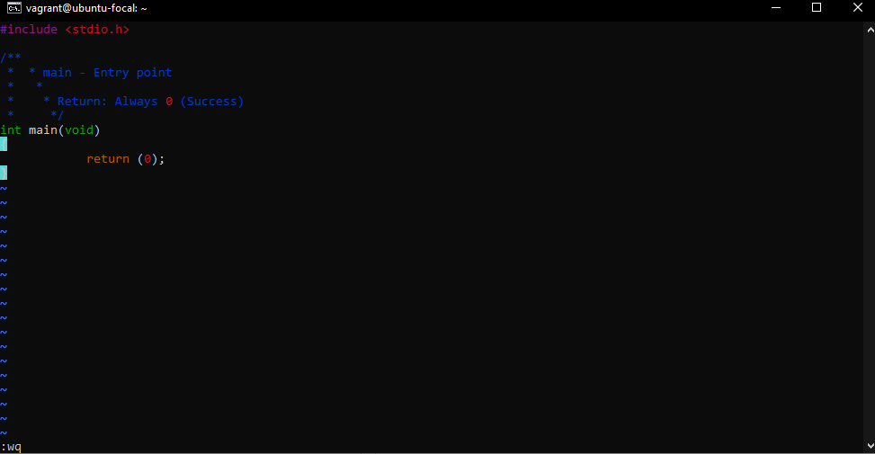
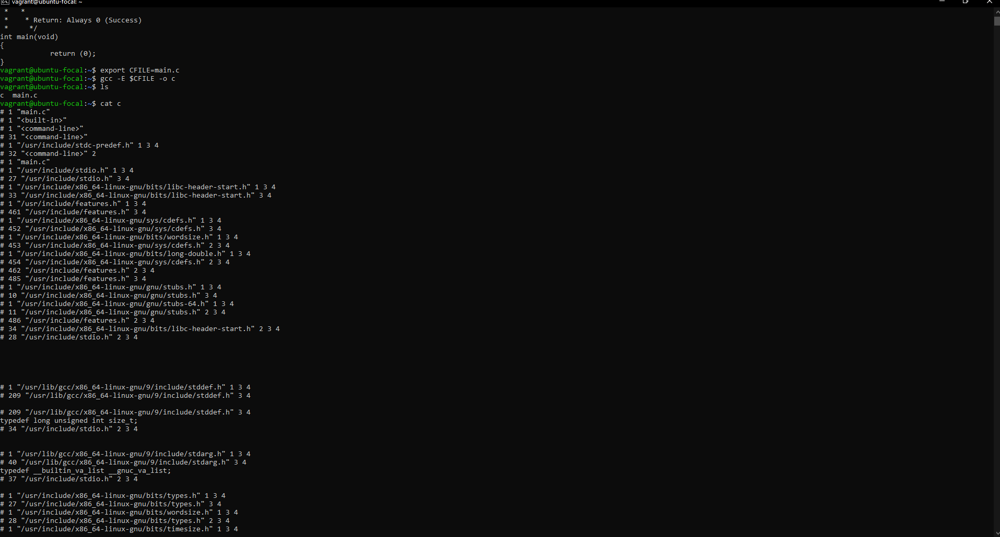

## Write a script that runs a C file through the preprocessor and save the result into another file.

- The C file name will be saved in the variable $CFILE
- The output should be saved in the file c
- The script in bash is:
```
#!/bin/bash
gcc -E $CFILE -o c
```

#### To test 
- In your terminal create a file called main.c
 ``` 
 vagrant@ubuntu-focal:~$ vi main.c
 ```
 Note: I am using vi / vim here to create and edit the file ast the same time on my virtual OS , ubuntu which is running on the Virtual machine vagrant on a virtual box

- Paste the following code into your main.c file which is open on the terminal using Vi

```
#include <stdio.h>

/**
 * main - Entry point
 *
 * Return: Always 0 (Success)
 */
int main(void)
{
    return (0);
}
```
- Press Esc key to exit Insert mode on Vi and press SHIFT + : and type wq (:wq) 



- Run ``` cat main.c ``` to verify that your file has the code you wrote/inserted

- Run ``` export CFILE=main.c ``` to save the file name main.c in a variable called CFILE.

- Run the command ``` gcc -E $CFILE -o c ``` . The -E option is to Stop the program  after the preprocessing stage, The -o option is to specify the Place of output in file, in thic case i c 
- Run ``` cat c ``` and you should be able to see some gibberish text in the terminal as on the below pic



## References
1. 